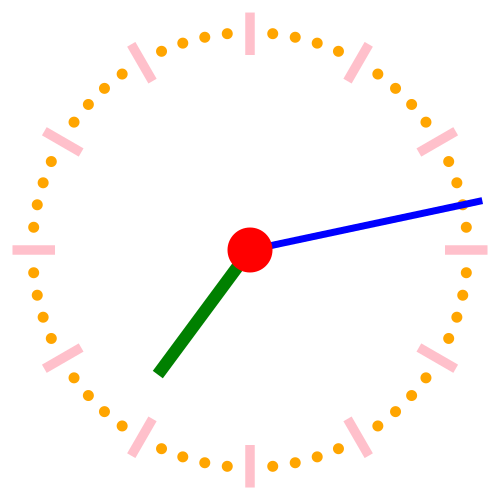

# clock_svg
Generate SVG clock

## Compilation

    make

## Running

    ./clock_svg
  
  or
  
    ./clock_svg 7
  
  or
  
    ./clock_svg 7 13

To save into a file:

    ./clock_svg 7 13 > clock_7_13.svg

To change the colour:

    ./clock_svg --colour=pink 7 13
  
  or to change only face colour
  
    ./clock_svg --facecolour=yellow 7 13
  
  or to change only colour of hands
  
    ./clock_svg --handcolour=red 7 13
  
  or to change all separately
  
    ./clock_svg --centrefacecolour=red --minutefacecolour=orange --hourfacecolour=pink --minutehandcolour=blue --hourhandcolour=green 7 13 > clock_example.svg
  
  
  
  or to change colour of hands to a different colour each
  
    ./clock_svg --minutehandcolour=yellow --hourhandcolour=red 7 13

Last colour applied will take presedence, all colours acceptable by the SVG fill attribute are acceptable.

  see also: https://developer.mozilla.org/en-US/docs/Web/SVG/Reference/Attribute/fill

## Example

## Thanks

* [Commons:User:Jahobr](https://commons.wikimedia.org/wiki/User:Jahobr) for rewriting [Commons:File:Clock_12-17.svg](https://commons.wikimedia.org/wiki/File:Clock_12-27.svg) making it possible to use it as a template for this program.
